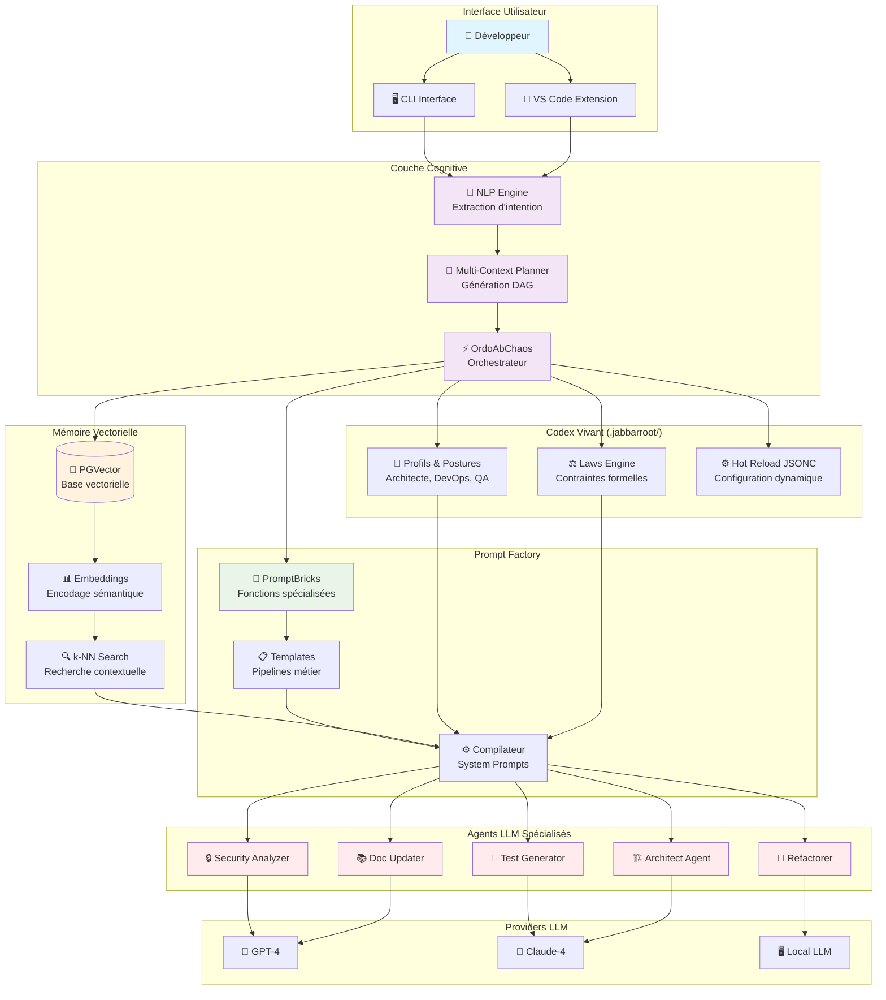
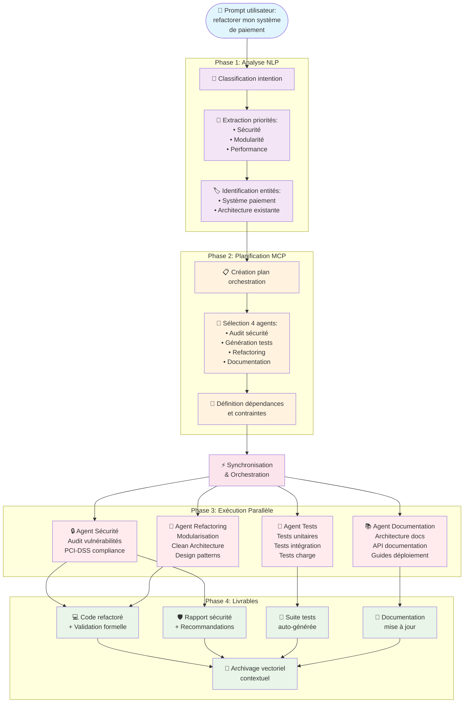
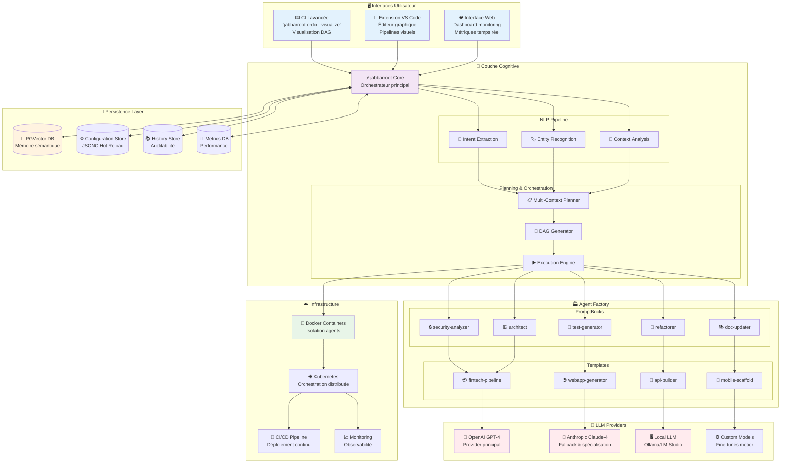

# Architecture Cognitive Distribuée - jabbarroot



# Processus de Compilation Cognitive - jabbarroot
```mermaid
sequenceDiagram
    participant Dev as 👤 Développeur
    participant NLP as 🧠 NLP Engine
    participant MCP as 🎯 MCP Planner
    participant PGV as 🧮 PGVector
    participant PF as 🏭 Prompt Factory
    participant Orch as ⚡ Orchestrateur
    participant Agents as 🤖 Agents LLM
    participant Output as 📦 Artefacts

    Dev->>NLP: "Prompt flou: j'ai une idée d'appli bancaire"
    
    Note over NLP: Extraction d'intention latente
    NLP->>NLP: Classification des entités métier
    NLP->>NLP: Identification des priorités
    
    NLP->>MCP: Intentions structurées
    MCP->>PGV: Recherche contexte similaire
    PGV-->>MCP: Contexte vectoriel pertinent
    
    Note over MCP: Génération DAG cognitif
    MCP->>MCP: Définition tâches & dépendances
    MCP->>MCP: Sélection agents spécialisés
    
    MCP->>PF: Plan d'orchestration
    PF->>PF: Sélection PromptBricks
    PF->>PF: Compilation system prompts
    
    PF->>Orch: Prompts contextualisés
    
    Note over Orch: Exécution parallèle
    Orch->>Agents: Prompt Security Analyzer
    Orch->>Agents: Prompt Architect Agent
    Orch->>Agents: Prompt Test Generator
    Orch->>Agents: Prompt Doc Updater
    
    par Agents parallèles
        Agents-->>Output: Code sécurisé
    and
        Agents-->>Output: Architecture modulaire
    and
        Agents-->>Output: Tests automatisés
    and
        Agents-->>Output: Documentation
    end
    
    Output->>PGV: Archivage vectoriel
    Output->>Dev: Projet structuré livré
    
    Note over Dev,Output: Cycle d'amélioration continue

```mermaid
# Structure du Codex Vivant (.jabbarroot/)
```mermaid
graph TD
    subgraph "📁 .jabbarroot/"
        subgraph "👔 Profils & Postures"
            ARCH_PROF[🏗️ Architecte FinTech<br/>- Sécurité prioritaire<br/>- Modularité<br/>- Performance]
            QA_PROF[🧪 Analyste Qualité<br/>- Tests exhaustifs<br/>- Code coverage<br/>- Validation formelle]
            DEVOPS_PROF[⚙️ Ingénieur DevOps<br/>- CI/CD<br/>- Containerisation<br/>- Monitoring]
            UX_PROF[🎨 Designer UX<br/>- Accessibilité<br/>- Ergonomie<br/>- Responsive]
        end
        
        subgraph "⚖️ Laws Engine"
            LAW1[🚫 no-circular-deps<br/>Absence dépendances circulaires]
            LAW2[🏷️ strict-typing<br/>Typage strict obligatoire]
            LAW3[📖 code-readability<br/>Lisibilité prioritaire]
            LAW4[🔒 security-first<br/>Sécurité par conception]
            LAW5[🧪 test-driven<br/>TDD obligatoire]
        end
        
        subgraph "⚙️ Configuration Dynamique"
            CONFIG[📄 config.jsonc<br/>Hot Reload]
            TEMPLATES[📋 templates/<br/>Pipelines métier]
            BRICKS[🧱 bricks/<br/>Fonctions atomiques]
            HISTORY[📚 history/<br/>Contexte vectoriel]
        end
    end
    
    subgraph "🔄 Mécanismes d'Interaction"
        RELOAD[🔥 Hot Reload<br/>Reconfiguration<br/>sans redémarrage]
        VALIDATOR[✅ Validateur<br/>Conformité aux lois]
        SELECTOR[🎯 Sélecteur<br/>Profil contextuel]
    end
    
    ARCH_PROF --> SELECTOR
    QA_PROF --> SELECTOR  
    DEVOPS_PROF --> SELECTOR
    UX_PROF --> SELECTOR
    
    LAW1 --> VALIDATOR
    LAW2 --> VALIDATOR
    LAW3 --> VALIDATOR
    LAW4 --> VALIDATOR
    LAW5 --> VALIDATOR
    
    CONFIG --> RELOAD
    TEMPLATES --> RELOAD
    BRICKS --> RELOAD
    
    SELECTOR --> RELOAD
    VALIDATOR --> RELOAD
    
    style ARCH_PROF fill:#e3f2fd
    style QA_PROF fill:#f1f8e9
    style DEVOPS_PROF fill:#fff3e0
    style UX_PROF fill:#fce4ec
    
    style LAW1 fill:#ffebee
    style LAW2 fill:#ffebee
    style LAW3 fill:#ffebee
    style LAW4 fill:#ffebee
    style LAW5 fill:#ffebee
    
    style CONFIG fill:#f3e5f5
    style RELOAD fill:#e8f5e8
```

# Scénario FinTech : Refactoring Système de Paiement



# Écosystème Complet jabbarroot


